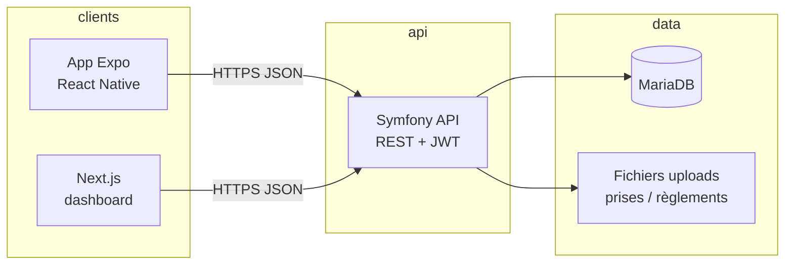

# STF (Street Fishing) — Présentation projet (portfolio)

Plateforme **web et mobile** pour **organiser et suivre des compétitions de pêche urbaine (street fishing)** : inscriptions par **équipes**, **prises** déclarées avec **photo** et **géolocalisation**, **périmètres** de pêche, **scores** et bonus (espèces, quotas), **validation des prises** par le jury, **notifications** et **tableaux de bord** pour les participants et l’administration. Le dépôt est un **monorepo** : application **Next.js** (dashboard), **API Symfony**, application **Expo / React Native** (terrain), orchestrés par **Docker Compose**.

---

## Rôle du projet

- **Côté terrain (mobile)** : authentification, consultation des compétitions et équipes, **ajout de prises** (espèce, taille, photo, GPS, membre pêcheur), historique, profil ; parcours **administrateur** pour la validation des prises et opérations de gestion.
- **Côté organisation (web)** : création et édition des **compétitions** (calendrier, espèces, coefficients, bonus, **périmètres sur carte**), équipes, règlement (texte et images), publication du classement.
- **Côté commun** : statistiques **publiques** (classement ouvert) ou restreintes ; **statistiques personnelles** et **par équipe** (endpoints dédiés, prises validées) pour graphiques, chronologie et cartes ; stockage des **photos** sur disque avec arborescence par compétition.
- **Périmètre honnête** : la géolocalisation **aide** au respect des zones ; elle ne constitue pas une preuve infailligible de présence (contournements côté client possibles — aligné avec une vision produit réaliste).

---

## Stack technique

| Couche | Technologies |
|--------|----------------|
| **Frontend web** | Next.js 15, React 19, Sass, Tailwind CSS, React Query, Leaflet / react-leaflet (périmètres, cartes), Recharts |
| **Mobile** | Expo ~54, React Native, React Navigation, React Query, Expo Location / Image Picker, react-native-maps |
| **Backend** | PHP 8.1+, **Symfony 6.4**, contrôleurs REST (attributs PHP 8), Doctrine ORM 3 |
| **Persistance** | MariaDB 10.11, migrations Doctrine |
| **Auth API** | JWT (**Lexik** JWT Authentication Bundle), refresh tokens (**gesdinet/jwt-refresh-token-bundle**), firewalls **stateless** |
| **Documents** | Dompdf (besoins PDF éventuels côté projet) |
| **Email** | Symfony Mailer (Google Mailer), vérification d’e-mail |
| **Sécurité HTTP** | Nelmio CORS, contrôle d’accès par chemins (`security.yaml`) |
| **Fichiers** | Uploads Symfony (photos de prises, images de règlement) sur volume Docker |
| **Charge / qualité** | Scénarios **k6** (`loadtests/`) pour les flux terrain critiques |
| **Conteneurs** | Docker Compose : `database` (MariaDB), `backend` (PHP / Apache ou équivalent selon `Dockerfile`), `frontend` (Next dev), **scheduler** (boucle métier pour pauses planifiées) |

*Note : le projet n’utilise pas API Platform ; l’exposition REST repose sur des **contrôleurs dédiés** et une sérialisation maîtrisée (DTO / tableaux) pour éviter les pièges de graphe d’entités.*

---

## Architecture générale



- **Mobile** : consommation de l’API via client HTTP centralisé (`EXPO_PUBLIC_API_URL`, en-têtes spécifiques tunnel **ngrok** si besoin).
- **Web** : `NEXT_PUBLIC_API_URL` vers le backend ; formulaires dashboard et pages publiques/équipes.
- **Backend** : routes sous `/api`, jeu de règles **public** (consultation compétitions, certaines stats) vs **authentifié** (prises, profil, stats « moi ») vs **admin** (`ROLE_ADMIN`).
- **Sécurité** : chemins publics explicitement listés ; le reste de `/api` exige en général un JWT valide ; stats personnelles sous `/api/competitions/{id}/me/...` et `/api/me/stats`.

---

## Structure du dépôt (aperçu)

```
STF_Project/
├── docker-compose.yml          # MariaDB, backend, frontend, scheduler
├── backend/                    # API Symfony
│   ├── src/
│   │   ├── Controller/         # Compétition, équipes, prises, auth, admin, uploads…
│   │   ├── Entity/             # Competition, Team, FishCatch, User, notifications…
│   │   ├── Repository/
│   │   ├── Service/            # Photos, géoloc, snapshots, notifications, règlement…
│   │   ├── Security/
│   │   └── Command/            # Migrations données (ex. photos base64 → fichiers)
│   ├── config/packages/        # security, doctrine, jwt, nelmio_cors, mailer…
│   ├── migrations/
│   └── Dockerfile
├── frontend/                   # Next.js (App Router)
│   └── src/
│       ├── app/                # Pages dashboard, compétitions, équipes…
│       ├── services/           # Appels API
│       └── styles/
├── mobile/                     # Expo
│   └── src/
│       ├── screens/
│       ├── services/
│       ├── contexts/
│       └── config/
├── loadtests/                  # k6 + script shell + README
└── aDoc/                       # Documentation hors code (UML, troubleshooting, portfolio)
```

---

## Modèle de données (aperçu)

Entités Doctrine au cœur du métier : **Competition**, **Team**, **FishCatch**, **CompetitionSpecies**, **CompetitionPerimeter**, **Species**, **User** ; relations **Many-to-Many** équipe ↔ membres (`competition_team_members`), **FishCatch** liée à **Team** et à **Competition** (historique), **caughtBy** → **User**. Entités satellites : invitations d’équipe, notifications, préférences, pauses planifiées, snapshots de scores, etc. Schémas détaillés : `aDoc/uml/`.

---

## API : approche par contrôleurs

L’API est structurée en **contrôleurs Symfony** (namespaces `Competition`, `Admin`, `Security`, etc.) avec :

- Sérialisation **explicite** pour les listes sensibles (ex. prises : éviter les références circulaires JSON).
- Services métier : **stockage fichier** des photos (`catches/AAAA/MM/{competitionId}/`), validation **géographique**, **snapshots** après compétition, **notifications** aux administrateurs.
- Endpoints **stats** : stats publiques par compétition ; stats **individuelles** et **équipe** pour utilisateur connecté ; stats **globales** utilisateur (`/api/me/stats`).

Pas d’API Platform : choix cohérent pour des **règles métier** (scores, bonus, validation) et des **réponses JSON** sur mesure.

---

## Front web & mobile : organisation

- **Next.js** : pages dashboard (création / édition compétition), fiches équipes, appels API centralisés.
- **Expo** : navigation par stack / onglets ; **React Query** pour le cache et le rafraîchissement ; écrans compétition (dont **mes statistiques** prises validées + équipe), ajout de prise, admin validation.
- **Style** : Sass / modules côté web ; StyleSheet React Native côté mobile.

---

## Qualité et tests

- **k6** : scénarios smoke et charge sur consultation compétition / stats / création de prises (`loadtests/README.md`).
- **PHPUnit** : présent dans le backend (`require-dev`) pour tests unitaires / fonctionnels selon ce qui est implémenté dans le dépôt.
- **Documentation** : `aDoc/` (UML PlantUML, guides de dépannage).

---

## Déploiement et environnement

- **Docker Compose** : ports typiques **8001** (backend), **3000** (frontend), **3312** (MariaDB exposée en dev).
- Variables **`.env`** (racine / backend) : base de données, `APP_SECRET`, `MAILER_DSN`, chemins uploads — **ne jamais commiter** les secrets.
- **Mobile** : build store ou Expo ; URL API via **variables d’environnement** ; tunnels (**ngrok**, **Expo tunnel**) pour tests terrain hors LAN.

---

## Compétences mises en avant (portfolio)

- Conception d’une **API REST** Symfony avec **JWT**, rôles et **règles d’accès fines**.
- **Monorepo** full-stack : **Next.js** + **React Native / Expo** + **Doctrine** / **MariaDB**.
- Métier **spatio-temporel** : périmètres, prises géolocalisées, chronologie et stats agrégées.
- Gestion **médias** (fichiers, migration base64 → disque), **Docker**, charge avec **k6**.
- **Modélisation relationnelle** et évolutions via **migrations**.
- Sens **produit** : stats « officielles » sur prises **validées**, communication claire sur les limites du GPS.

---

## Pistes d’amélioration (optionnel, entretien ou roadmap)

- Poursuivre les **vues stats** : cartes et graphiques à partir des champs déjà exposés (`timeline`, `catchesForMap`).
- **CI** (lint, tests PHP, build front) et **monitoring** en production.
- Renforcer la **détection** des positions fictives côté Android (dissuasion) et politique **règlement / jury** pour la triche.
- Internationalisation si besoin (UI et messages API).

---

## Documentation et schémas

- **`aDoc/README.md`** : index de la documentation hors code.
- **`aDoc/uml/*.puml`** : diagrammes PlantUML (ERD, classes, architecture).
- **`aDoc/troubleshooting/`** : diagnostics (ex. stats compétition).

---

*Document rédigé pour usage portfolio — à compléter (captures d’écran, lien démo, dépôt public ou privé) selon votre présentation.*
